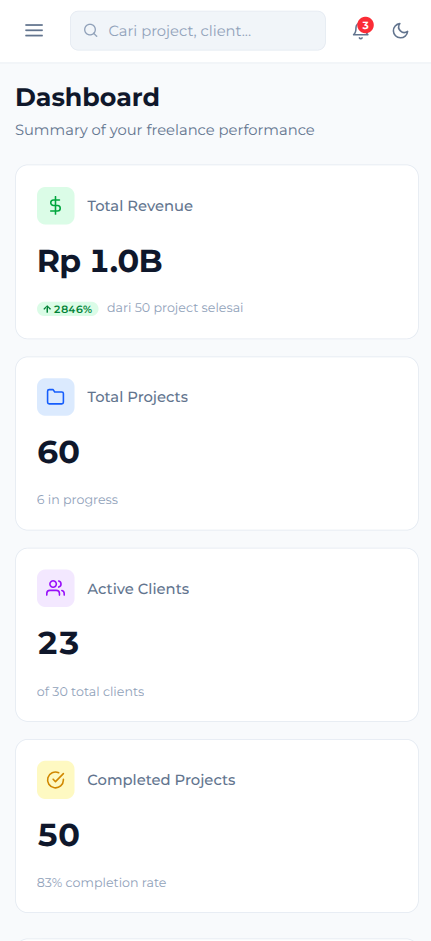
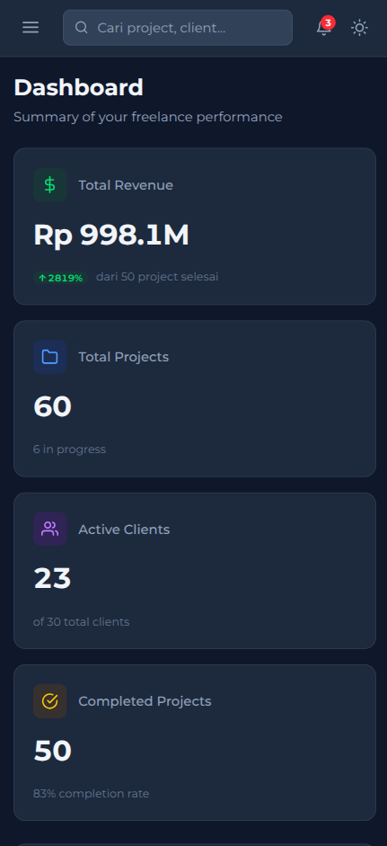
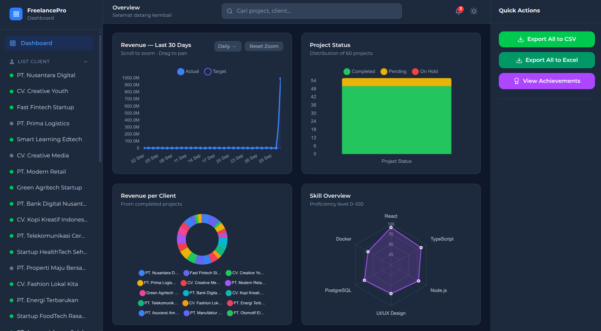
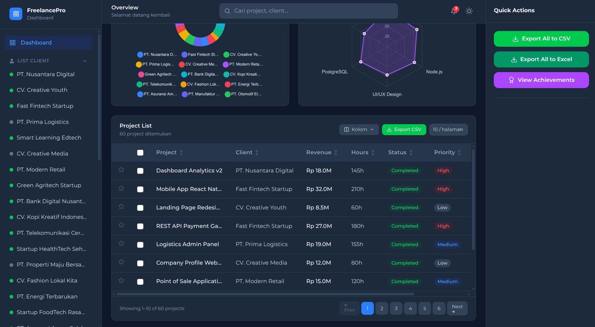
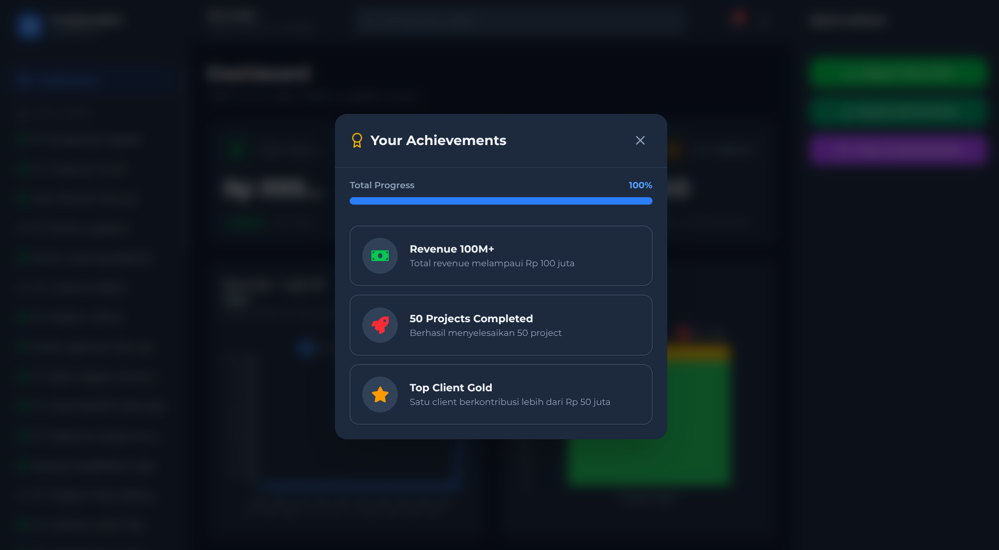
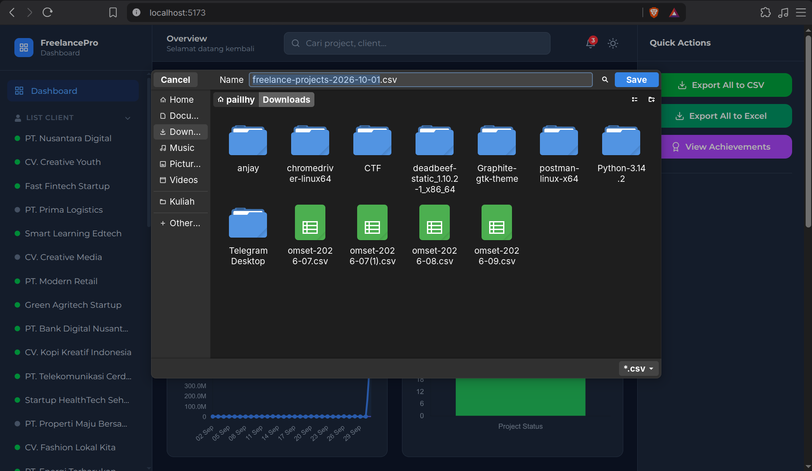
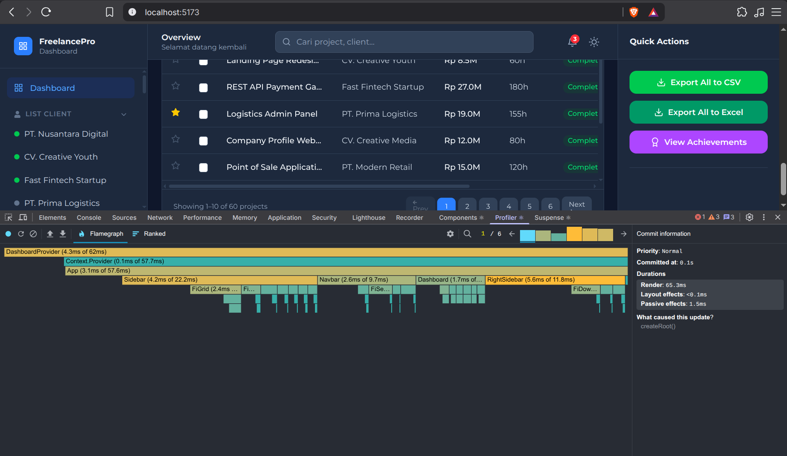
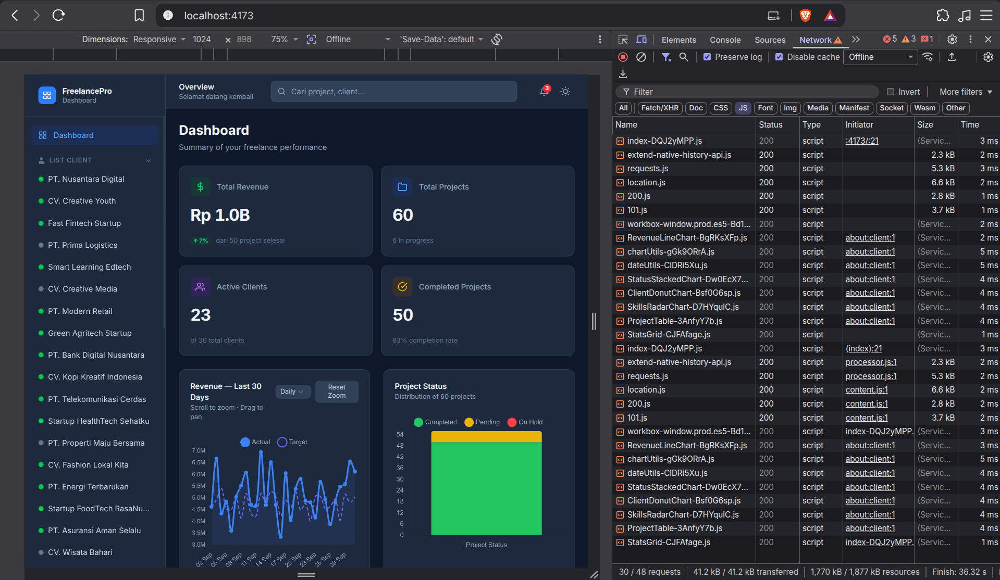
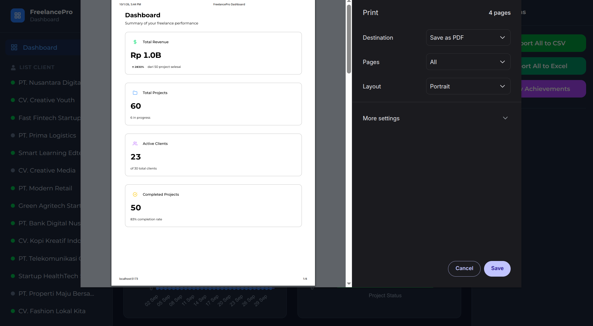

# 🚀 FreelancePro Dashboard (Task 10)

> Advanced React Dashboard teroptimasi untuk _tracking project_ dan _revenue_ bagi Freelance Developer. Didesain secara khusus dan mendetail untuk memenuhi seluruh **Technical Audit Requirements Task 10 Magang Udacoding**.


## ✨ Fitur Utama (Sesuai Requirement)

- 📊 **4 Interactive Charts** — Line (Revenue), Stacked Bar (Status), Donut (Client), Radar (Skills) menggunakan Chart.js. Tersedia filter Daily/Weekly/Monthly.
- 📋 **Advanced Data Table** — Fitur _Pagination, Multiple Sorting (Shift+Click), Filter Search,_ dan _Favorites_.
- 📥 **Export to CSV & Excel** — _Quick Actions_ untuk mengunduh laporan tabel dalam format `.csv` maupun native `.xlsx`.
- 🌙 **Dark/Light Mode** — Tema dinamis dengan kustomisasi lebih dari 12 token warna Tailwind v4.
- ⚡ **Real-time Revenue (Websocket Simulation)** — Angka *revenue* akan berkedip dan diperbarui otomatis setiap 30 detik tanpa me-render ulang seluruh halaman.
- 🏆 **Achievement System** — Sistem *gamification* dengan 5 kriteria lencana (Bekerja sama dengan _react-confetti_ untuk animasi perayaan).
- 📱 **Fully Responsive & Print-Ready** — Tata letak *stacked* untuk *mobile*, Sidebar *accordion*, dan Mode Cetak (`@media print`) yang bersih.
- 🔧 **PWA (Progressive Web App)** — Aplikasi sepenuhnya dapat di-_install_ di perangkat dan berjalan mulus tanpa koneksi internet (Offline Mode).
- ⚙️ **Ultra Performance Optimized** — Memanfaatkan `React.memo` (terbukti di DevTools), `useCallback`, `useMemo`, `lazy loading`, dan `Suspense`. Font menggunakan **Montserrat** secara global.

---

## 📸 Bukti Implementasi (12 Audit Screenshots)

Berikut adalah lampiran bukti visual bahwa aplikasi ini telah 100% memenuhi dan melampaui kriteria **"Screenshot 12 Bukti"** yang diwajibkan:

### 1. Cover / Hero Banner


### 2. Desktop Full Layout (Light)


### 3. Dark Mode Comparison


### 4. Mobile Responsive Stacked (Light)


### 5. Mobile Responsive Stacked (Dark)


### 6. 4 Charts Different States
Menampilkan distribusi grid 2x2, interaktivitas, dan variasi _tools/tooltips_.


### 7. Table Pagination + Sort + Favorites
Tabel dinamis dengan *pagination*, logika *multi-sorting*, indikator *favorites*, dan label status berwarna.


### 8. Achievement Popup Confetti
*Modal pop-up* yang dipicu dari _Right Sidebar_, lengkap dengan animasi *confetti*.


### 9. CSV / Excel Export Preview
Bukti eksekusi _export_ dari tabel ke format Excel/CSV secara *native* yang dibuka pada *spreadsheet reader*.


### 10. Performance DevTools (React.memo Effect)
Bukti *Profiling* bahwa `StatsCard` **tidak melakukan render ulang (Did not render)** ketika *state global/context* berubah, menghemat resource komputasi secara signifikan.


### 11. PWA & Offline Mode
Aplikasi terdeteksi sebagai aplikasi mandiri (PWA) dan tetap dapat memuat antarmuka dengan normal saat koneksi internet terputus.


### 12. Print Preview (Bonus Requirement)
Tampilan cetak (Ctrl+P / Cmd+P) di mana _sidebar_ disembunyikan dan konten memanjang ke bawah dengan format bersih.


---

## 🛠 Tech Stack

| Kategori  | Teknologi                     |
| --------- | ----------------------------- |
| Frontend  | **React 19, Vite 8**          |
| Styling   | **Tailwind CSS v4**           |
| State     | Context API + useReducer      |
| Charts    | Chart.js 4, react-chartjs-2   |
| Icons     | react-icons (Feather & FontAwesome) |
| Export    | xlsx, PapaParse               |
| Animation | react-confetti                |
| PWA       | vite-plugin-pwa + Workbox     |
| Fonts     | Montserrat (Google Fonts)     |

---

## 📦 Installation & Running

```bash
# 1. Clone repository
git clone https://github.com/USERNAME/react-freelance-dashboard-pro.git
cd react-freelance-dashboard-pro

# 2. Install dependencies
npm install

# 3. Jalankan Development Server
npm run dev          # http://localhost:5173

# 4. Build & PWA Testing (Production)
npm run build
npm run preview      # http://localhost:4173
```

---

## 👨‍💻 Author

**FailHy** — Frontend Developer  
- GitHub: [FailHy](https://github.com/FailHy)
- Repository: [Task 10 - Magang Udacoding](https://github.com/Magang-Udacoding/task-10)

> _"Di-build dengan standar performa dan praktik terbaik React Modern."_